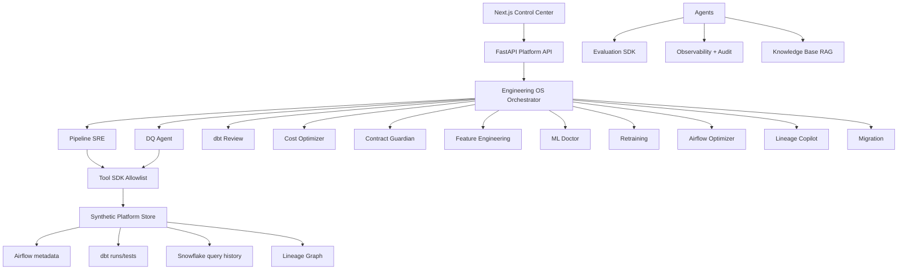

# Architecture

## Shared contracts

Every agent execution records:

`execution_id, agent, objective, state, tool_calls, hypotheses, findings, actions, approvals, final_result`

Public views expose investigation steps and evidence — not private chain-of-thought.

## Evidence classes (UI)

- Observed fact
- Model inference
- Agent hypothesis
- Recommended action
